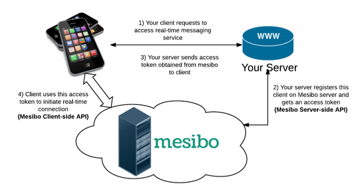
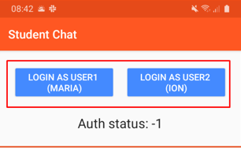
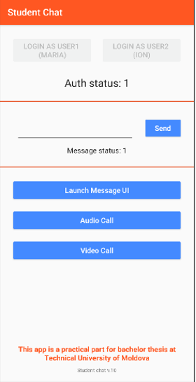
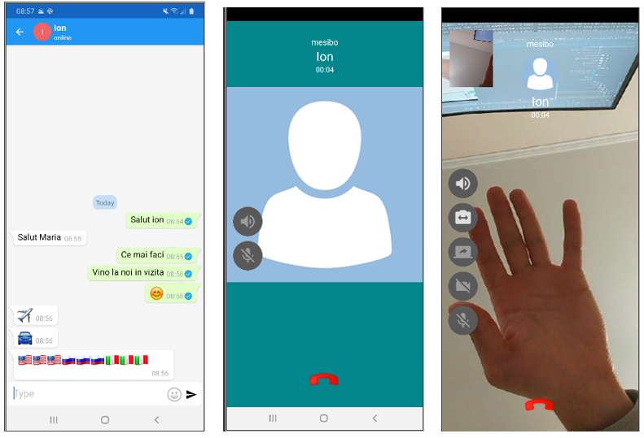

# student_chat
Mobile application for secure communication

- we created credentials for user 1 and user 2 and put them in class
AuthData, there is the token for authentication in the Mesibo system (se
uses the OAuth2 security standard);
- communication between users is secure (AES-256 is used
and SSL);

App start screen:

App Server:

Host app http://mesibo.com/

Get tokens for authentication:

The basic screen in the student chat chat:

Communication screens in Student chat:

Other options:
  Share screen
  Change the front and back camera
  Activate sound speaker
  Camera on/off
  Microphone on/off
